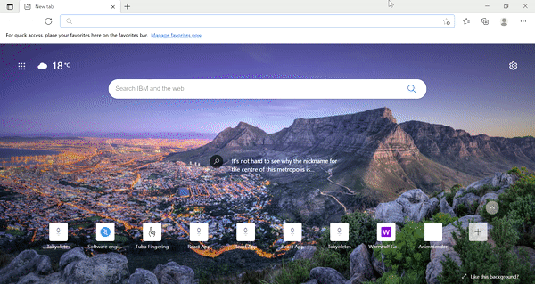

# Tokyoletes

<div style="text-align:center">
  
</div>
## Tools:
* React
* Apollo GraphQL Server
* Apollo GraphQL Client
* Data provided by Kaggle

## Run locally:
```
    cd server
    node index.js 

```

```
    cd client
    npm start
```